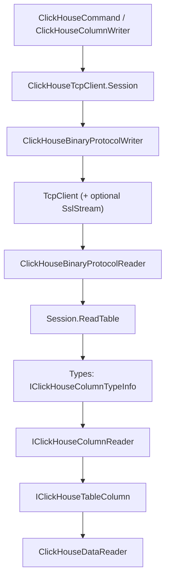

# AGENTS.md

Orientation for AI agents working in this repository.

For anything about the contribution process itself — bug reports, licensing headers, the changelog,
dependencies — read [CONTRIBUTING.md](CONTRIBUTING.md) before you start editing. It also contains a
block of instructions specifically for agents.

## What this is

`Octonica.ClickHouseClient` is a .NET driver for [ClickHouse](https://clickhouse.com/), exposed as an
ADO.NET provider (`DbConnection` / `DbCommand` / `DbDataReader` / `DbProviderFactory`).

It speaks the **ClickHouse native TCP binary protocol** (port 9000 by default), not HTTP. This matters
more than anything else here: almost every non-trivial bug is a wire-format bug. The protocol is
versioned by a revision number that the client advertises during the handshake, and the server uses
that number to decide which wire features it may use. The current value lives in
[ClickHouseProtocolRevisions.cs](src/Octonica.ClickHouseClient/Protocol/ClickHouseProtocolRevisions.cs)
as `CurrentRevision`. Raising it makes the server enable more features, so the client must be able to
read everything below it.

## Projects

All three live under [src](src) and are in [Octonica.ClickHouseClient.sln](src/Octonica.ClickHouseClient.sln).

* `Octonica.ClickHouseClient` — the library. Targets `net6.0`, `net8.0` and `net10.0`.
  `Nullable` is enabled, `TreatWarningsAsErrors` is on, and `GenerateDocumentationFile` is on.
* `Octonica.ClickHouseClient.Tests` — xUnit v3. Targets `net8.0` and `net10.0`. Most tests need a
  live server; see [CONTRIBUTING.md](CONTRIBUTING.md) for how to point them at one. The library grants
  the test assembly `InternalsVisibleTo`, so internal classes can be tested directly.
* `Octonica.ClickHouseClient.Benchmarks` — BenchmarkDotNet.

## Repository layout

Within `src/Octonica.ClickHouseClient`:

* **Root namespace** — the public ADO.NET surface plus the transport. `ClickHouseConnection`,
  `ClickHouseCommand`, `ClickHouseDataReader`, `ClickHouseColumnWriter` (the proprietary bulk-insert
  API), `ClickHouseParameter`, `ClickHouseConnectionStringBuilder`, and the socket-level
  `ClickHouseTcpClient`, `ClickHouseBinaryProtocolReader` and `ClickHouseBinaryProtocolWriter`.
* **`Protocol/`** — the wire format. Client and server message classes, message codes, block header and
  field codes, LZ4 compression, CityHash, and the revision constants.
* **`Types/`** — the ClickHouse type system. The largest folder by far.
* **`Utils/`** — internal helpers: buffers, read-only list adapters, type dispatch, timezones, TLS.
* **`Exceptions/`** — the exception hierarchy and `ClickHouseErrorCodes`.

## Query flow



A `Session` is one unit of work on the connection, guarded by a semaphore so only one query runs at a
time. `ClickHouseCommand` substitutes parameters, builds a `ClientQueryMessage`, and hands it to
`Session.SendQuery`; the response is read message by message until a data block arrives, and
`Session.ReadTable` turns that block into columns.

The transport layer is deliberately type-agnostic: it reads a column's name, type name and
serialization mode, then asks the type registry for a reader and feeds bytes into it. If you are
fixing how a *value* is decoded, you want `Types/`. If you are fixing block framing, message order or
compression, you want the root and `Protocol/`.

## Type system

Each ClickHouse type is a small family of cooperating classes:

* `XxxTypeInfo : SimpleTypeInfo` (or `IClickHouseColumnTypeInfo` directly) — metadata plus factories.
  Parametric types like `Array(T)` or `Nullable(T)` implement `GetDetailedTypeInfo` to parse their
  arguments.
* An `IClickHouseColumnReader` — decodes bytes from a `ReadOnlySequence<byte>` and produces a table
  column in `EndRead`. A skipping variant discards the data instead.
* An `IClickHouseColumnWriter` — encodes .NET values into a `Span<byte>`.
* An `XxxTableColumn : IClickHouseTableColumn<T>` — the in-memory column that `ClickHouseDataReader`
  reads values from.

To add a type, write those four and register the type info in
`ClickHouseTypeInfoProvider.GetDefaultTypes()` in
[ClickHouseTypeInfoProvider.cs](src/Octonica.ClickHouseClient/Types/ClickHouseTypeInfoProvider.cs).
Types whose behavior depends on the server (timezones, revision-gated formats) are reconfigured
through `Configure(serverInfo)` when the connection opens.

Columns may arrive under a non-default serialization mode (sparse, replicated, and combinations of
them). Those are handled by `CustomSerializationColumnReader`, which reads the mode prefix and then
delegates to the underlying type's reader. `ClickHouseColumnSerializationMode` lists the modes and
notes which are unsupported.

## Coding style

Match the file you are editing. The conventions below are what the codebase actually does.

* Four spaces, Allman braces (opening brace on its own line).
* `_camelCase` for private fields, usually `readonly`. No `this.` qualification.
* `var` for locals where the type is obvious; explicit types elsewhere.
* Expression-bodied members for trivial properties.
* Public members need XML documentation — `GenerateDocumentationFile` plus warnings-as-errors makes a
  missing `<summary>` a build failure. Internal types generally have no XML docs.
* Interfaces that are part of the extensibility surface carry a `<remarks>` noting that they are
  infrastructure and may change between minor versions. Keep that wording if you add one.

### Nullability

Nullable reference types are enabled, and warnings are errors in the library — a nullability warning
is a build failure, not a hint.

**Do not silence one with the null-forgiving operator.** Writing `something_nullable!` to make the
compiler stop complaining is a big no. It states the invariant to the compiler and to nobody else, so
when the assumption turns out to be wrong you get a `NullReferenceException` further along, with
nothing left in the code to say why null was thought impossible there.

Narrow the type with `Debug.Assert` instead. The compiler's flow analysis understands it, so the
warning goes away, and in a debug build a violated assumption fails at the place that made it rather
than at the place that tripped over it:

```csharp
Debug.Assert(_offsets != null);
Debug.Assert(_baseReader != null);

var result = _baseReader.ReadNext(sequence);
```

This is the established pattern — there are dozens of these, mostly in `Types/`. When the invariant
belongs to a public contract rather than to one method's internals, express it in the signature with
`[NotNullWhen]`, `[MaybeNullWhen]` or `[AllowNull]`, which the codebase also uses.

If `!` is genuinely unavoidable — an assert cannot express the invariant, or the nullability is an
artifact of a generic signature such as returning `default(T)` where `T` may be a nullable type — then
use it and leave a comment explaining why you are sure it holds. The comment is the requirement here,
not the operator.

### Namespaces

Use **file-scoped** namespaces (`namespace Octonica.ClickHouseClient.Types;`) in new files.

Existing files are overwhelmingly block-scoped. Leave them as they are — do not convert a file's
namespace style just because you are editing it.

### Do not reformat

Indentation and formatting are inconsistent in places. That is accepted and is not yours to fix.

Never tidy whitespace, line endings or namespace style in a file you are editing for another reason.
Whitespace churn outside a dedicated maintenance commit makes the history untraceable — a later
`git blame` or `git log -L` on a real bug lands on a reformatting commit instead of the change that
caused it. Restrict your diff to the lines your change actually requires.

## Sync and async share one implementation

Public APIs come in sync and async pairs, but there is only ever one implementation. The pattern is a
private method taking a `bool async` flag and a `CancellationToken`, returning `ValueTask`:

```csharp
private async ValueTask<bool> Read(bool async, CancellationToken cancellationToken)
```

Inside, I/O branches on the flag:

```csharp
if (async)
    await stream.WriteAsync(buffer, cancellationToken);
else
    stream.Write(buffer.Span);
```

The public sync entry point calls it with `async: false` and unwraps the already-completed task through
`TaskHelper.WaitNonAsyncTask`; the async entry point calls it with `async: true` and awaits.

```csharp
public override void Open()
{
    TaskHelper.WaitNonAsyncTask(Open(false, CancellationToken.None));
}

public override async Task OpenAsync(CancellationToken cancellationToken)
{
    await Open(true, cancellationToken);
}
```

Follow this for any new code that touches the network. Do not add a second, parallel sync
implementation, and do not make the sync path block on a genuinely asynchronous task —
`WaitNonAsyncTask` assumes the work completed synchronously.

## Read these before searching

When you need to know how something is represented on the wire, these two specifications are the
authority. Consult them before searching the web, and before inferring the format from this client's
own code — the client is what you are verifying, so it cannot be the reference.

* Native protocol — messages, handshake, blocks, revision feature gates:
  <https://raw.githubusercontent.com/ClickHouse/ClickHouse/refs/heads/master/docs/reference/interfaces/specs/NativeProtocol.mdx>
* Native format — column serialization per data type:
  <https://raw.githubusercontent.com/ClickHouse/ClickHouse/refs/heads/master/docs/reference/interfaces/specs/NativeFormat.mdx>

For behavior the specifications do not pin down, the ClickHouse server source is the next stop —
`src/DataTypes/Serializations/` for column formats and `src/Server/TCPHandler.cpp` for revision gating.

Project documentation that is useful in its own right: [README.md](README.md),
[docs/TypeMapping.md](docs/TypeMapping.md), [docs/Parameters.md](docs/Parameters.md),
[docs/ClickHouseColumnWriter.md](docs/ClickHouseColumnWriter.md), and
[CHANGELOG.md](CHANGELOG.md) — the changelog is a good way to find when a protocol revision or a type
was last touched.
